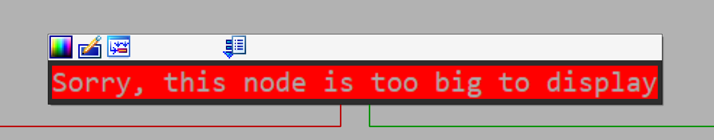

# AutoCrypt: Multi-Layer Automata-Based Encryption

AutoCrypt is an experimental Proof Of Concept compile-time string encrypt system based on multi-layer finite automata.

## Features
- Multi-layer automaton-based encryption
- Key-dependent automaton generation
- Non-linear transformations
- Position-dependent encryption using a counter
- Emulator makes brrr
- Not xor

## Usage

```cpp
    #include "autocrypt.hpp"

    // @note / SapDragon: Default usage
    constexpr std::string_view key = "secret_key";
    constexpr std::string_view plaintext = "Hello, AutoCrypt!";

    constexpr auto dfa = autocrypt::GenerateComplexDFA(key);
    constexpr auto encrypted = autocrypt::EncryptString(plaintext, dfa);

    auto decrypted = autocrypt::DecryptString(encrypted, dfa);

    std::cout << "Original: " << plaintext << std::endl;
    std::cout << "Decrypted: " << decrypted.data() << std::endl;

    // @note / SapDragon: Using AUTOCRYPT macros
    auto runtime_decrypted1 = AUTOCRYPT("First encrypted string");
    auto runtime_decrypted2 = AUTOCRYPT("Second encrypted string");

    std::cout << "Runtime decrypted 1: " << runtime_decrypted1 << std::endl;
    std::cout << "Runtime decrypted 2: " << runtime_decrypted2 << std::endl;
```

## IDA Pro example 


## Contributing
Contributions are welcome! Please feel free to submit a Pull Request.

## License

This project is licensed under the MIT License - see the LICENSE file for details.